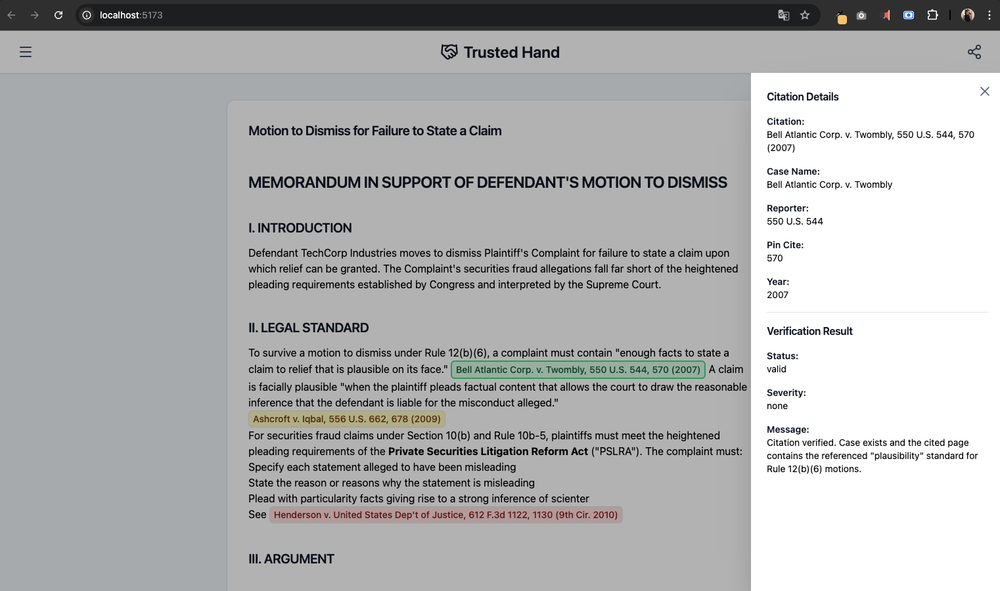

# Trusted Hand - Frontend Challenge

Transform this functional-but-ugly citation verification interface into a world-class experience.

## The Product

Trusted Hand verifies citations in legal briefs. Lawyers upload a document, and the system checks whether cited cases exist, quotes are accurate, and authorities are still good law.

This starter shows the **annotated document view**—where users scroll through their brief, see flags on problematic citations, and click to understand what's wrong.

---

## Implemented Features

The app has been enhanced to feel like a polished product, focusing on readability, interaction, and responsiveness.



### ✅ Features Completed

1. **Basic Style**
   - Applied Tailwind CSS to structure layout and style text.
   - Converted inline CSS to Tailwind classes for consistency.

2. **Markdown Rendering**
   - Integrated `react-markdown` to render brief content correctly.
   - Styled headings (h1–h4), blockquotes, lists, and emphasis for clarity.

3. **Citation Interaction**
   - Created `CitationMarker` component for `[[CITATION:n]]` markers.
   - Clicking a citation opens the **DetailPanel** on the right side.
   - DetailPanel shows verification info: case name, status, severity.
   - Close button (X) hides the panel and returns to normal view.

4. **Loading State**
   - Added skeleton screens using `react-loading-skeleton`.
   - Local state manages loading for brief content and detail panel.

5. **API Call Simulation**
   - `useFetchBrief` hook simulates fetching data with delay.
   - Supports error simulation (`simulate = "error"`) and retry logic.
   - Demonstrates different error states after multiple retries.

6. **Header Implementation**
   - Header with menu hamburger and share icons (click shows alert).
   - Icons imported from **Lucide React**.
   - Responsive layout styled with Tailwind CSS.

---

## Installation and Setup

```bash
npm install
npm run dev
```

Open [http://localhost:5173](http://localhost:5173) to see the current state.


## Libraries Installed

- `react-markdown` → Markdown rendering  
- `react-loading-skeleton` → Loading placeholders  
- `@tailwindcss/typography` → Enhanced typography  
- `lucide-react` → Icons for header and buttons  

## Tech Stack

- Vite + React 18 + TypeScript + Tailwind CSS  

---

## How It Works

1. Brief content loads with skeletons during fetching.  
2. Markdown content is rendered with styled headings, lists, and blockquotes.  
3. Citation markers appear inline; clicking opens the **DetailPanel** with verification details.  
4. DetailPanel can be closed using the X button to return to normal state.  
5. API call simulation supports **success**, **error**, and **retry** states.  

---

## Sample Data

| Citation | Status | Severity |
|----------|--------|----------|
| Bell Atlantic Corp. v. Twombly | Valid | None |
| Ashcroft v. Iqbal | Quote Mismatch | Warning |
| Henderson v. United States Dep't of Justice | Not Found | Critical |
| Dura Pharmaceuticals, Inc. v. Broudo | Valid | None |
| Basic Inc. v. Levinson | Overruled | Warning |
| Tellabs, Inc. v. Makor Issues & Rights | Valid | None |

---

## Project Structure

```
src/
├── components/
│   ├── BriefViewer.tsx        # Renders brief with markdown and interactive citations
│   ├── CitationMarker.tsx     # Inline clickable citation component
│   └── DetailPanel.tsx        # Shows verification details for selected citation
├── data/
│   └── sampleBrief.ts         # Sample brief and verification results
├── hooks/
│   └── useFetchBrief.ts       # API call simulation with error handling and loading
├── types/
│   └── index.ts               # TypeScript interfaces
├── App.tsx                    # Main app component (layout, header, cards)
└── main.tsx                   # Entry point
```

---

## Commits Summary

- Added skeletons for loading states.  
- Added markdown rendering and styling.  
- Implemented interactive citation markers with DetailPanel toggle.  
- Added header with icons and menu interactions.  
- Simulated API calls with errors and retry logic.  
- Refactored styles to Tailwind CSS.  
- Updated layout and responsiveness of brief and DetailPanel.  

---

## Future Improvements that I would do if I have more time

- Unit testing with **Jest**.  
- Animations and micro-interactions (Framer Motion, React Spring).  
- Performance and SEO optimization via Google Lighthouse.  
- Architecture improvements: BFF, services, controllers, gateways following clean architecture.  
- Accessibility improvements (ARIA roles, keyboard navigation, focus states).  
- Event emission for analytics (page views, clicks) to GA/New Relic dashboards.  
- Logging layer for troubleshooting.  
- Further refactoring and code improvements.  
- Custom interface inspired by apps like **Substack** using Google Stitch.  

---

## Design Rationale

The main focus was to transform the rough starter into a **polished, usable interface**. I prioritized **readability**, **interaction design**, and **feedback loops** such as skeletons and clickable citations. The DetailPanel provides clear verification information while loading states and API simulation ensure responsiveness under different scenarios. The header and interactive icons enhance navigation and user feedback. Future work would focus on testing, accessibility, animations, analytics, and further architectural refinements to make this a production-ready experience.

## Questions?

Email-me: conceicaolanai@gmail.com
